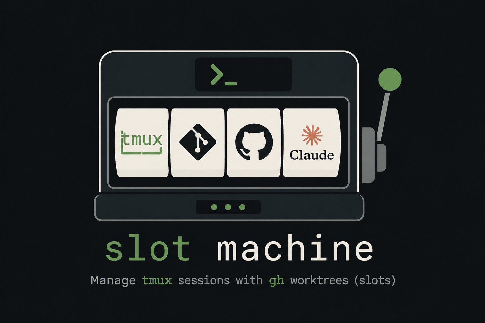

# slot machine

Run a fleet of coding agents against one repo, in parallel, without them stepping on
each other - from a single tmux session you drive like a dispatcher. Claude Code is the
built-in default; point any repo or slot at a different agent (see [Agents](#agents)).

`sm` lays out one git worktree ("slot") per agent ("worker"), builds a tmux session with
one worker pane per slot plus a control window (the "desk"), and gives you the operations
a dispatcher needs: see who's free, hand off work, check in, and reclaim finished slots.
It ships as a CLI (`sm`) and a zero-dependency MCP server, so both you and your agents can
drive it.

## The problem it solves

One coding agent per repo checkout is the natural limit: two agents in one working tree
clobber each other's branches, index, and build artifacts. Worktrees fix the isolation,
but running many of them surfaces the next set of problems - the ones slot machine
actually exists for:

- **"Which slot is safe to reuse?"** A lock file lies (its owner may be dead), and an
  empty-looking worktree may hold a worker mid-task that just hasn't branched yet.
- **"What is everyone doing?"** Eyeballing N panes doesn't scale, and transcript
  silence doesn't mean idle - a slow tool call looks identical to done.
- **"How do workers reach you?"** Scraping their panes is lossy; results get stranded
  in scrollback.
- **Shared one-of-a-kind resources** - an authenticated browser, a port - get raced and killed.

What the workflow gains you: N tracks of work in flight with one dispatcher (you, or
an agent in the desk seat) at the wheel, safe reuse decided from evidence, and a structured
loop - find capacity, hand off, check in, reclaim - instead of digging through tmux by hand.

## The mental model

A **session** is a floor with a **desk** and a row of **slots**. The **dispatcher** sits
at the desk; a **worker** sits in each slot. The dispatcher never leaves the desk and
never touches a slot's files; workers never leave their slot. Work flows one way (desk ->
slot via `sm worker run` / `sm msg send`), results flow back the other (slot -> desk via
`sm msg report`, read with `sm msg inbox`).

Each slot cycles:

```
free -> handed a task (locked, wip) -> PR open (waiting-merge) -> merged -> reset -> free
```

`sm slot ls` classifies every slot along that cycle from its git branch + GitHub PR state,
and `sm slot reset` closes the loop by returning a merged slot to a clean base. The
dispatcher's whole job is keeping that cycle turning: `sm worker role` prints the full
briefing for either seat (dispatcher brief at the desk, worker brief inside a slot).

## Opinions

slot machine is opinionated. The opinions, explicitly:

1. **One slot, one worker, one track of work.** No sharing, no doubling up.
2. **The dispatcher delegates and observes - never edits.** If a slot needs a fix, its
   worker makes it.
3. **Freeness is evidence, not vibes.** Reusability is derived from branch + PR state;
   a lock is authoritative for _busy_, never for _free_ (owners die; `sm lock prune`
   reclaims stale ones deterministically).
4. **Structured back-channel over pane-scraping.** Reporting via `sm msg report` is part
   of a worker being done.
5. **Shared one-of-a-kind resources are locked, not raced.** `sm lock claim browser` is
   atomic; the loser learns who holds it instead of killing it.
6. **Rigid vocabulary.** Every concept has exactly one name (below); a test fails the
   suite if the docs drift.
7. **Agents are first-class operators.** Every query and action takes `--json` (the
   interactive session builder is the one exception), the MCP server mirrors the CLI
   (minus the client-interactive commands: session create/attach/detach, preflight,
   stats), and usage is recorded locally (`sm stats`) so the interface evolves from
   evidence.

## Vocabulary

The rigid definitions (`sm help vocab`):

| term           | definition                                                                                         |
| -------------- | -------------------------------------------------------------------------------------------------- |
| **repo**       | the git repo a session is built around; everything derives from it                                 |
| **slot**       | one worktree of the repo; holds at most one worker and one track of work                           |
| **worker**     | the coding-agent process in a slot's pane (Claude by default, or any configured agent)             |
| **desk**       | the session's first window; the seat the dispatcher runs the session from                          |
| **dispatcher** | the role at the desk: finds capacity, hands off, checks in, reclaims - never edits a slot          |
| **session**    | the multiplexer session laying out the desk + slot panes for one repo                              |
| **lock**       | a claim on a slot (`.worktree-lock`) or a shared machine resource (e.g. the authenticated browser) |

## Install

Node >= 22 and a terminal multiplexer required - tmux by default, or zellij >= 0.44 (see
[Multiplexers](#multiplexers)); `gh` (authenticated) powers PR-state classification.

```sh
git clone <this repo> && cd slot-machine
node bin/sm doctor --fix
```

`doctor --fix` detects and installs everything safely automatable: the `~/.local/bin`
symlinks (`sm`, `slot-machine`, `slot-machine-mcp`), the tmux pane-title block, and MCP
registration with Claude Code (`claude mcp add slot-machine`), then re-verifies and tells
you what's left (e.g. `gh auth login`, PATH). Prefer manual? Symlink `bin/*` yourself and
register the MCP server with `claude mcp add slot-machine -s user -- ~/.local/bin/slot-machine-mcp`.

### Install (Homebrew)

Published via the [tylerbre/homebrew-tap](https://github.com/tylerbre/homebrew-tap) tap
(`node` is the only dependency; `sm` is the shell bin):

```sh
brew install tylerbre/tap/slot-machine
```

The formula lives in the tap. To cut a release: `npm run pack` (produces
`slot-machine-vX.Y.Z.tar.gz` of tracked files at HEAD) -> attach it to the `vX.Y.Z` GitHub
release here -> bump the formula's `url`/`sha256` in the tap
(`shasum -a 256 slot-machine-vX.Y.Z.tar.gz`).

## Quick start

```sh
sm repo use ~/code/acme             # point sm at a repo; prefix/session/base derive from it
sm slot create a; sm slot create b; sm slot create c    # set up three slots
sm session create                   # build + attach the session (desk + worker panes)

# from the desk:
sm slot ls                          # who's free? (git branch + PR state)
sm worker run "fix ABC-123: <link>" # hand a task to the first free worker
sm worker ps                        # who's working / idle / waiting?
sm worker logs a                    # one worker in depth: last message + pane tail
sm msg inbox                        # read what workers reported back
sm slot reset a                     # merged? return it to a clean base

sm                                  # any time later: hop back into the most recent session
```

`sm doctor` verifies the whole setup (tmux/git/gh, repo config, slots, pane titles);
`sm doctor --fix-tmux` writes the recommended pane-title settings into your tmux.conf
(a marked block, safe to re-apply) and applies them live - with many worker panes, the
border title is how you tell them apart.

## Commands

Commands are namespaced by the noun they act on, with docker-style generic verbs
(`ls`, `inspect`, `create`, `rm`, `kill`):

```
sm doctor                                check environment + repo health
sm stats [--days N]                      command usage: counts, error rates, timings
sm help [ns] [cmd] | vocab               overview, namespace, command detail, or vocabulary

sm repo ls                               known repos (current marked with *)
sm repo use REPO                         select the current repo (derives root/prefix/session/base)
sm repo inspect [REPO]                   one repo's resolved context
sm repo rm REPO                          forget a repo (config only)
sm repo config [--agent N] [--model M]   set the repo's default agent instance + model

sm agents ls                             the agent roster: each instance, its plugin, models
sm agents dir [PATH]                     get/set where user plugins live (~/.config/slot/agents)
sm agents add NAME [--use P|--plugin F]  add an instance (--env K=V, --models a,b, --default-model M, --mcp FILE)
sm agents rm NAME                        remove an instance (refused if another instance uses it)

sm session ls                            list the repo's running sessions
sm session create [N] [name] [--kill]    build or attach a session (N = 2|3|4 panes/window)
sm session attach [NAME]                 attach/switch (default: most recent; bare 'sm' too)
sm session detach [NAME]                 detach your client (or every client of NAME)
sm session reload [NAME]                 add panes for slots created after the session was built
sm session kill NAME... | --all          kill session(s); conversations survive on disk

sm slot ls [--free|--watch]              classify each slot: free/merged (reusable) vs busy
sm slot inspect SLOT                     one slot in depth: branch, worker, lock, PRs
sm slot focus SLOT | -f                  jump the tmux client to a slot's pane
sm slot create LABEL [base] | rm LABEL   create / remove a slot worktree (create takes --agent/--model)
sm slot config LABEL [--agent] [--model] set a slot's agent-instance/model override
sm slot reset SLOT [--force]             return a slot to a clean base branch @ origin/<base>

sm worker ps [--watch]                   every worker: live/dead, activity, current task
sm worker run MESSAGE [--brief]          hand a task to the first reusable slot's worker
sm worker logs SLOT [-n N] [-f]          one worker in depth: activity, last message, pane tail
sm worker kill SLOT                      end a worker's process; its pane falls back to a shell
sm worker role [dispatcher|worker]       print the desk->slots operating model (auto-detected)
sm worker preflight                      assert cwd is your slot worktree (workers, before git work)

sm msg send MESSAGE [-s SPEC|-f]         type a line into slot panes (all, a subset, or -f first-free)
sm msg report "MSG" | sm msg inbox       worker -> dispatcher back-channel (report to send, inbox to read)

sm lock ls                               list held resource locks (holder, age, task)
sm lock claim NAME [task] | release NAME lock a slot OR shared resource (e.g. browser) / free it
sm lock prune SLOT... | --stale          remove stale worktree locks (dead owner session)
```

Add `--json` to most commands for machine-readable output; `--repo DIR` targets a repo
for one command. `sm --help` is the overview; `sm help <ns>` prints a namespace; `sm <ns>
<cmd> --help` (or `sm help <ns> <cmd>`) gives detailed help with examples.

### Freeness

`sm slot ls` decides reusability from each slot's git branch + GitHub PR state (not just
the lock file):

| status          | meaning                                                                     |
| --------------- | --------------------------------------------------------------------------- |
| `free`          | reusable - idle on its base branch                                          |
| `merged`        | reusable - all PRs for the branch are merged                                |
| `waiting-merge` | busy - open PR                                                              |
| `wip`           | busy - commits ahead of the base, no PR yet                                 |
| `dirty`         | busy - uncommitted changes                                                  |
| `closed-pr`     | busy - PR closed without merging                                            |
| `locked`        | busy - a live session holds the worktree                                    |
| `stale`         | busy - locked, but the owner session is dead (reclaim with `sm lock prune`) |
| `active`        | busy - a live worker is mid-task (no branch/lock yet)                       |

## Repos

Everything derives from a repo's main-worktree dir, so `sm` is multi-repo:

- **root** = the repo's parent dir (slots are siblings)
- **prefix** = `<name>-slot-` (repo `acme` -> `acme-slot-`)
- **session prefix** = `<name>`
- **base branch** = the repo's default branch (`origin/HEAD`), else `main`

Set the current repo (persisted in `~/.config/slot/config.json`); all commands then act
on it:

```sh
sm repo use ~/code/acme                                          # derive + select
sm repo use ~/code/foo --prefix wt- --session foo --base master  # override derived values
sm repo ls                                                       # show current + known repos
```

Any command also takes `--repo DIR` for a one-off repo without switching:

```sh
sm --repo ~/code/foo slot ls
```

## Agents

Each slot runs a coding agent. **Claude is the built-in default**, and an untouched setup
behaves exactly as before. To run a different agent - or several separately-configured
Claudes - slot machine resolves each slot to an _agent instance_ through a small plugin
contract, so the core never hardcodes any one agent.

- **plugin** - the conformance code for an agent type (`claude` is built in): how to launch it,
  tell whether its pane is working/waiting/idle, read its last message, and resume its transcript.
- **instance** - a named, configured use of a plugin, kept in the roster
  (`~/.config/slot/config.json`). Instances sharing a plugin differ only by env, model, and MCP
  servers, so `personal-claude` and `enterprise-claude` are two instances of the one `claude`
  plugin, each with its own `CLAUDE_CONFIG_DIR`.

Per slot the agent resolves as: the slot's override -> the repo's default -> the built-in `claude`.

```sh
sm repo config --agent claude --model sonnet            # this repo's default agent + model
sm slot create b --agent claude --model haiku           # a slot pinned to a different model
sm agents add enterprise-claude --use claude \
  --env CLAUDE_CONFIG_DIR=~/.claude-work                 # a second Claude, different account
sm repo config --agent enterprise-claude                # make it this repo's default
sm agents ls                                            # the roster + each instance's status
```

**User plugins.** Point `sm agents dir` at a directory of plugin modules, then register one:
`sm agents add my-agent --plugin my-agent.mjs --models fast,smart --default-model fast`. A
plugin (or instance) can also declare its own MCP servers (`--mcp servers.json`), wired into
that agent by `sm doctor --fix`. Built-in agents are held to full contract conformance. A user
plugin that fails to load is skipped and reported by `sm agents ls`; one that loads but
misbehaves at runtime degrades (its slot is left at a shell) rather than crashing the tool.

## Multiplexers

The session/pane layer sits behind the same plugin-contract pattern as agents. **tmux is the
built-in default**, and an untouched setup behaves exactly as before. Zellij (>= 0.44) ships
as a second backend - select it globally in `~/.config/slot/config.json`:

```jsonc
{ "settings": { "mux": "zellij" } }
```

Every backend implements one contract (sessions > windows > panes, addressed by returned
handles; structured pane records; type/submit/capture primitives), conformance-tested for
both built-ins. Worker panes are stamped with their slot label at spawn, so slot correlation
survives a worker `cd`-ing away from its worktree on either backend.

**Zellij is experimental**, with two known v1 limits: `sm worker kill` cannot resolve the
pane's process (zellij exposes no pane pid - end the worker from inside its pane), and
worker live/dead detection for shell panes uses a prompt heuristic (zellij does not report a
pane's foreground command). Requires zellij >= 0.44.0; older versions are refused with a
clear error.

## MCP

`slot-machine-mcp` is a zero-dependency stdio MCP server that wraps the CLI - each tool shells out
to `sm <ns> <cmd> --json`, so it stays in step with the CLI. The tools
mirror the CLI: `sm_repo_ls`, `sm_repo_use`, `sm_doctor`, `sm_session_ls`, `sm_session_kill`,
`sm_session_reload`, `sm_slot_ls`, `sm_slot_focus`, `sm_slot_inspect`, `sm_slot_create`, `sm_slot_rm`,
`sm_slot_reset`, `sm_worker_ps`, `sm_worker_run`, `sm_worker_logs`, `sm_worker_kill`, `sm_worker_role`, `sm_msg_send`,
`sm_msg_report`, `sm_msg_inbox`, `sm_lock_claim`, `sm_lock_release`, `sm_lock_ls`,
`sm_lock_prune`.

The agent-roster commands (`sm agents ...`, `sm repo config`, `sm slot config`) are dispatcher
setup and are intentionally CLI-only - not exposed as MCP tools. A worker reaches this MCP
server itself; a plugin can register additional MCP servers for its agent, wired by
`sm doctor --fix`.

## Develop

```sh
npm test          # node --test (discovers test/)
npm run lint      # eslint (@antfu/eslint-config - one opinionated preset; it also owns formatting)
npm run format    # eslint --fix (antfu formats; there is no Prettier)
npm run pack      # slot-machine-vX.Y.Z.tar.gz of HEAD (tracked files only)
```

`lib/` is organized by responsibility, no barrel files - import from the specific module:

- `slots/` - `pure.mjs` (classification/parsing, unit-tested), `locks.mjs` (the worktree
  document: claim/worker/turn sections, serialized atomic writes, embedded resource locks),
  `journal.mjs` (the append-only per-repo turn journal), `gather.mjs` (multiplexer/git/gh state).
- `mux/` - the multiplexer plugin system: `contract.mjs` (the op catalog), `tmux.mjs` and
  `zellij.mjs` (backends; every backend format string lives in its backend), `index.mjs`
  (registry + the send-reliability helpers built on backend primitives).
- `plugin/contract.mjs` - the ok/err envelope and guarded call path shared by the agent and
  multiplexer plugin systems.
- `commands/` - one file per namespace (`repo`/`session`/`slot`/`worker`/`msg`/`lock`/`top`) plus
  `shared.mjs` (cross-command helpers).
- `schema.mjs` + `elevators.mjs` - the zero-dep JSON-Schema validator, loader, and version-migration
  runner; the schemas themselves live in `schema/` (lockfile, config, inbox, usage, one per command).
- `argspec.mjs` - the single arg-spec adapter so the CLI parser and the MCP tools cannot drift.
- `exec.mjs` (git/gh/OS-process plumbing), `format.mjs` (output), `context.mjs` (repo resolution +
  config), `constants.mjs` (config/data), `help.mjs` (usage/vocabulary text), `router.mjs` (dispatch table).

`bin/sm` and `bin/slot-machine` are thin entry points over the router; `bin/slot-machine-mcp` is the
MCP server, whose tools are derived at runtime from `schema/commands/*.json`. See
[docs/architecture.md](docs/architecture.md) for diagrams and [CHANGELOG.md](CHANGELOG.md) for the
release history. Integration tests drive real tmux against this machine's configured repo and skip
cleanly where there isn't one.
