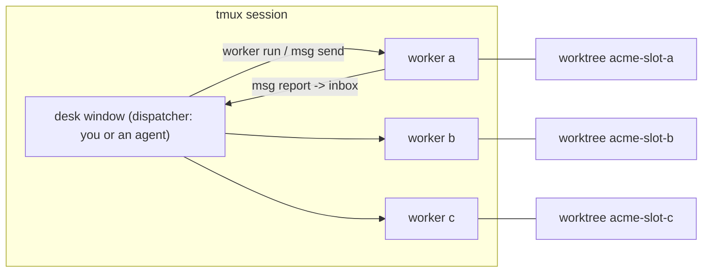
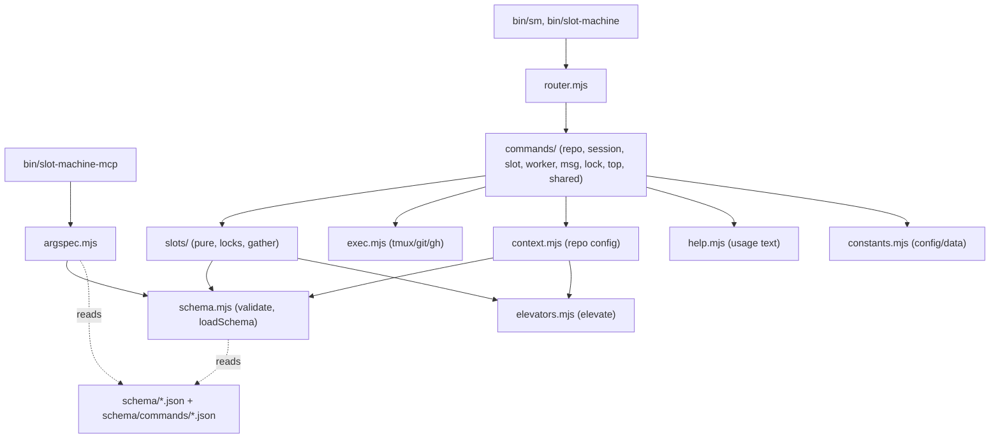
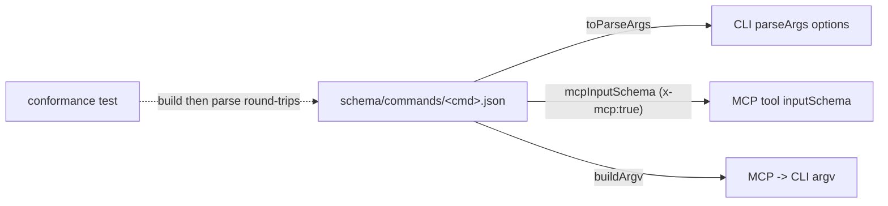
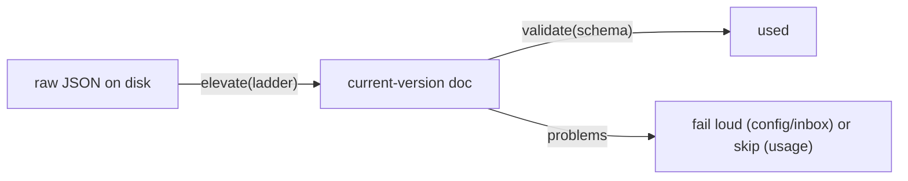
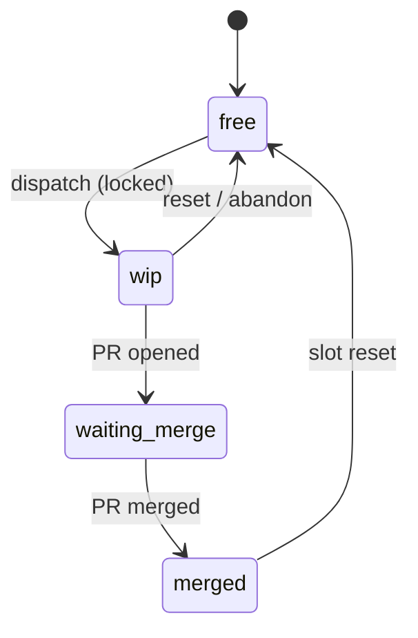

# Architecture

How `sm` (slot machine) is put together. Diagrams are Mermaid and render on GitHub.

## Runtime topology

One tmux session per repo: a **desk** window you dispatch from, and one pane per **slot** (a git
worktree) running a Claude **worker**. Work flows desk -> slot; results flow slot -> desk through a
per-repo inbox.

## Module layers

Dependencies point one way (no cycles, no barrel files - each module imports from the specific file
it needs). Both entry surfaces - the CLI router and the MCP server - sit on top of the same `lib/`.

Within `slots/`, `pure.mjs` is a leaf (classification/parsing, no I/O); `locks.mjs` depends on it;
`gather.mjs` (tmux/git state) depends on both. Within `commands/`, `shared.mjs` is a leaf; the only
cross-namespace edges are `worker -> msg` (`worker run` is `msg send --first-free`) and `msg -> slot`.

## One arg-spec, no CLI/MCP drift

Each command's arguments are defined once in `schema/commands/<cmd>.json` (a JSON-Schema `inputSchema`
plus an `x-cli` block and an `x-mcp` flag). `lib/argspec.mjs` adapts that single file into all three
consumers, so they cannot disagree; a conformance test proves the round-trip.

## Versioned data models

Every persisted document is a versioned JSON model described by a schema in `schema/` and validated
by the zero-dep `validate()`. Old data is upgraded on read by an elevator ladder (`elevate()`), so a
schema bump is seamless.

- **worktree lock** (`.worktree-lock`, one per slot) - the single lockfile; shared resources (the
  authenticated browser, a port) are embedded in its `resources` array, each described by the
  resource-lock schema the worktree schema references by `$ref`.
- **config** (`~/.config/slot/config.json`) - repos + current; validated loud on load.
- **inbox** and **usage** records - JSONL; inbox is strict, usage is lenient.

## Slot lifecycle

`sm slot ls` classifies every slot along this cycle from its git branch + GitHub PR state; `sm slot
reset` closes the loop.

